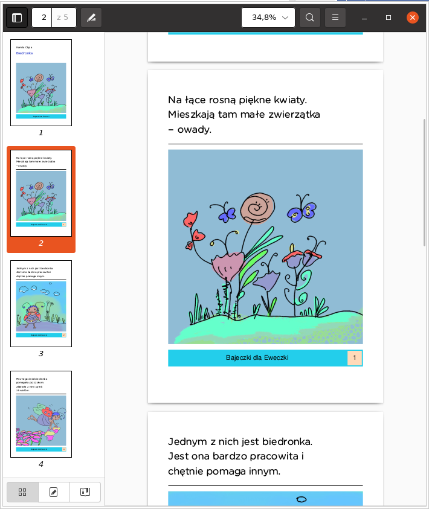

## Goal 
Generates simple pdf file from a .toml file.

This is a simple, script-like Java program that helps me generate little books in a useful format (.pdf)
 for my daughter.

## Usage
Assuming there exists dir1/description.toml file, executing:
``` shell
java -jar target/bajki-1.0-SNAPSHOT.jar dir1 ...
```
will generate dir1/output.pdf.
All image files referred in dir1 are resolved as relative to dir1.

## Result
Generated .pdf viewed in evince browser:


## Related project
See [stories](https://github.com/kamchy/stories) (written in JavaScript) for generating static .html files.


## Related blog posts
To find the description of expected toml data see [article about my stories](http://kamilachyla.com/posts/premiera-serii-bajek-dla-dzieci/).
For details of pdf generation in this project see [article about how I generated simple pdf documents in Java](https://kamilachyla.com/posts/generate_pdf/).


